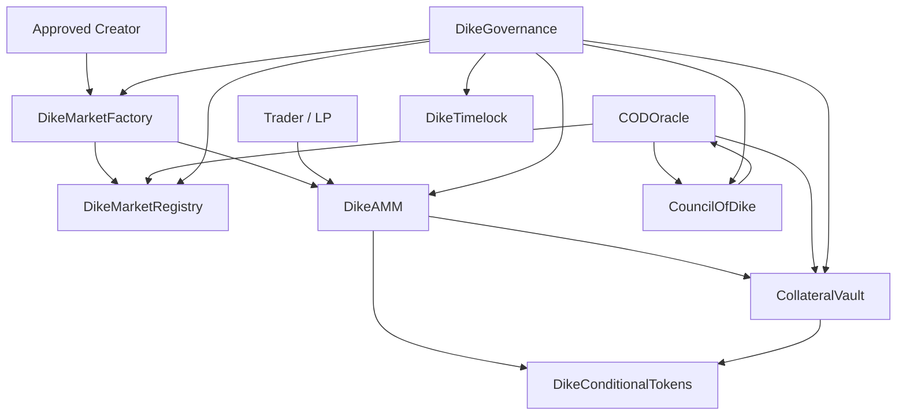

# Dike Soroban Contracts


Smart contracts for **Dike Protocol**, a modular binary prediction-market system on Stellar Soroban.

Dike markets use USDC/SAC collateral, YES/NO conditional positions, AMM trading, optimistic resolution, and a whitelisted Council of Dike dispute process. The contracts are written as a Rust workspace and designed to be tested, deployed, and audited module by module.

[Overview](#overview) - [Architecture](#architecture) - [Contracts](#contracts) - [Getting Started](#getting-started) - [Deployment](#deployment) - [Safety Notes](#safety-notes)

> [!IMPORTANT]
> This repository contains smart contracts for financial market infrastructure. Treat every deployment as experimental until it has been independently reviewed and tested with the exact role wiring, collateral contract, and network configuration you intend to use.

## Overview

Dike Protocol supports a curated v1 prediction-market flow:

1. An approved creator creates a binary YES/NO market.
2. USDC collateral backs complete YES/NO sets.
3. Traders buy or sell positions through the AMM.
4. After expiry, anyone can request resolution.
5. A proposer posts an outcome with a bond.
6. If undisputed, the outcome finalizes after the dispute window.
7. If disputed, the Council of Dike resolves by commit-reveal vote.
8. Winning or invalid-refund positions redeem through the vault.

Core design goals:

- **Solvency first**: no unbacked outcome positions.
- **Explicit state machines**: market and oracle status transitions are separated.
- **Modular custody**: collateral, positions, trading, oracle, council, and governance are distinct contracts.
- **Curated v1 scope**: market creation, collateral support, modules, fees, and council members are permissioned.

## Architecture



## Contracts

| Contract | Responsibility |
| --- | --- |
| `DikeMarketFactory` | Curated market creation, module coordination, initial AMM liquidity. |
| `DikeMarketRegistry` | Canonical market metadata, status machine, collateral support, final outcomes. |
| `DikeConditionalTokens` | Internal YES/NO position balances, complete-set minting, transfer checks, redemption burns. |
| `CollateralVault` | USDC/SAC custody, market accounting, redemptions, child-market credit, fees, oracle bonds. |
| `DikeAMM` | Fixed-product YES/NO pools, LP shares, buys, sells, liquidity removal. |
| `FeeManager` | Fee, reward, and bond calculation helpers. |
| `CODOracle` | Optimistic resolution requests, proposals, disputes, council escalation, finalization. |
| `CouncilOfDike` | Whitelisted commit-reveal voting for disputed markets. |
| `DikeGovernance` | Governed parameters, modules, supported collateral, council membership, upgrade hashes. |
| `DikeTimelock` | Queued, delayed, cancellable execution records for critical actions. |
| `mock_usdc` | Local/dev-only SEP-41-style collateral token. |

Shared crates:

| Crate | Purpose |
| --- | --- |
| `dike-types` | Shared contract types, statuses, config structs, errors, constants. |
| `dike-math` | Checked arithmetic, fee math, collateral limits, AMM quote helpers. |

## Repository Layout

```text
.
├── contracts/              # Soroban contract crates
├── crates/                 # Shared Rust crates
├── docs/DEPLOYMENT.md      # Deployment runbook
├── scripts/deploy-testnet.sh
├── scripts/local-flow.md   # Manual operator flow
├── deployments/            # Deployment manifests
├── PLAN.md                 # Protocol design plan
└── Cargo.toml              # Workspace manifest
```

## Getting Started

### Prerequisites

- Rust stable with `wasm32-unknown-unknown`
- Stellar CLI with Soroban support
- A local Stellar container or Testnet identity

```bash
rustup target add wasm32-unknown-unknown
cargo test
cargo build --release --target wasm32-unknown-unknown
```

> [!NOTE]
> This workspace currently uses `soroban-sdk = "23"`. If you upgrade the Stellar CLI template or SDK major version, update the workspace together and rerun the full contract suite.

### Run Tests

```bash
cargo test
cargo clippy --all-targets --all-features
cargo build --release --target wasm32-unknown-unknown
```

The test suite includes unit and integration-style Soroban tests for:

- Full production graph market creation, trading, resolution, and redemption.
- AMM tradeability, liquidity, cancellation, and child-market buy flows.
- Vault accounting, redemptions, child credit/debt repayment, and invalid refunds.
- Oracle proposal, dispute, council escalation, and finalization paths.
- Registry transition invariants and fee config validation.
- Timelock overflow and execution windows.

Soroban test snapshots live under each contract's `test_snapshots/` directory and should be reviewed when behavior changes.

## Deployment

For production-like deployments, use a real Stellar Asset Contract for USDC:

```bash
export NETWORK=testnet
export SOURCE=alice
export USDC_ISSUER=GBBD47IF6LWK7P7MDEVSCWR7DPUWV3NY3DTQEVFL4NAT4AQH3ZLLFLA5
./scripts/deploy-testnet.sh
```

If you already know the SAC contract address:

```bash
export COLLATERAL_CONTRACT=<real-usdc-sac-contract-id>
./scripts/deploy-testnet.sh
```

For local-only simulations without a real SAC:

```bash
export NETWORK=local
export ALLOW_MOCK_USDC=true
./scripts/deploy-testnet.sh
```

The deployment script:

- Builds optimized Soroban WASM into `target/stellar`.
- Deploys or reuses contract aliases.
- Wires module roles across the registry, tokens, vault, AMM, oracle, council, and factory (including CODOracle's `fees`/`treas` roles for bond-split payouts).
- Registers supported collateral and an approved market creator.
- Optionally registers `EXTRA_CREATOR`/`EXTRA_COUNCIL_MEMBER` addresses as an additional approved creator and council member.
- Writes a manifest to `deployments/<network>.json`.

### Current Testnet Deployment

Manifest: [`deployments/testnet.json`](deployments/testnet.json)

| Field | Value |
| --- | --- |
| Network | Testnet |
| Deploy source (paid deploy/wiring txns) | `alice` |
| Admin / Treasury / Governance authority (all modules, rotated post-deploy via `set_admin`/`set_role gov`) | [`GAYOEII6EPU3SYBKNYEVJL36R3KVUN4UKHUWB3XTGLCLPTOWVBWZBE4G`](https://stellar.expert/explorer/testnet/account/GAYOEII6EPU3SYBKNYEVJL36R3KVUN4UKHUWB3XTGLCLPTOWVBWZBE4G) |
| Approved creators | `alice` operator address [`GD7CNH2G45HDZ44UR6AUZJV65ZRNH5UO3UPJQLCLKTSPYQXTHP75R4CV`](https://stellar.expert/explorer/testnet/account/GD7CNH2G45HDZ44UR6AUZJV65ZRNH5UO3UPJQLCLKTSPYQXTHP75R4CV) and [`GAYOEII6EPU3SYBKNYEVJL36R3KVUN4UKHUWB3XTGLCLPTOWVBWZBE4G`](https://stellar.expert/explorer/testnet/account/GAYOEII6EPU3SYBKNYEVJL36R3KVUN4UKHUWB3XTGLCLPTOWVBWZBE4G) |
| Council member | [`GAYOEII6EPU3SYBKNYEVJL36R3KVUN4UKHUWB3XTGLCLPTOWVBWZBE4G`](https://stellar.expert/explorer/testnet/account/GAYOEII6EPU3SYBKNYEVJL36R3KVUN4UKHUWB3XTGLCLPTOWVBWZBE4G) |
| Collateral | USDC Stellar Asset Contract |
| USDC issuer | [`GBBD47IF6LWK7P7MDEVSCWR7DPUWV3NY3DTQEVFL4NAT4AQH3ZLLFLA5`](https://stellar.expert/explorer/testnet/account/GBBD47IF6LWK7P7MDEVSCWR7DPUWV3NY3DTQEVFL4NAT4AQH3ZLLFLA5) |
| USDC SAC | [`CBIELTK6YBZJU5UP2WWQEUCYKLPU6AUNZ2BQ4WWFEIE3USCIHMXQDAMA`](https://stellar.expert/explorer/testnet/contract/CBIELTK6YBZJU5UP2WWQEUCYKLPU6AUNZ2BQ4WWFEIE3USCIHMXQDAMA) |
| Mock USDC | Not deployed or wired for this testnet manifest |

| Module | Contract ID |
| --- | --- |
| DikeTimelock | [`CALRV2BUQCCYUIN4BVX2FGU45UIVPFL7RXQ4KQLPSQUHBE44IMDWQHB5`](https://stellar.expert/explorer/testnet/contract/CALRV2BUQCCYUIN4BVX2FGU45UIVPFL7RXQ4KQLPSQUHBE44IMDWQHB5) |
| DikeGovernance | [`CDYKZNTKGJFA4IE6HCYHZIZO2OQUCY264XFJRQIZ3MIYKZFRVFHNLEBO`](https://stellar.expert/explorer/testnet/contract/CDYKZNTKGJFA4IE6HCYHZIZO2OQUCY264XFJRQIZ3MIYKZFRVFHNLEBO) |
| DikeMarketRegistry | [`CDEK6DTJF3ZBKEHQRZLAEUQCWVXCSFC42L2NJD3UYJXGCBQBDWXPU2U5`](https://stellar.expert/explorer/testnet/contract/CDEK6DTJF3ZBKEHQRZLAEUQCWVXCSFC42L2NJD3UYJXGCBQBDWXPU2U5) |
| DikeConditionalTokens | [`CA5ZM5EYKKOUUCTJ5QUL4HJFOVUDOKCXAPI6CF5IEVCWUKN4OINWTOOP`](https://stellar.expert/explorer/testnet/contract/CA5ZM5EYKKOUUCTJ5QUL4HJFOVUDOKCXAPI6CF5IEVCWUKN4OINWTOOP) |
| CollateralVault | [`CAIPPIDLXYT6NNLYQIZHXEWAVQIJXLNM4INKUDV46V42U2Y3DW7E25B4`](https://stellar.expert/explorer/testnet/contract/CAIPPIDLXYT6NNLYQIZHXEWAVQIJXLNM4INKUDV46V42U2Y3DW7E25B4) |
| DikeAMM | [`CC6R3J7SZUATE7SMJDEVLXWNWJEXTLVD2XQNORYUMH7JCKE2YFT4RKRR`](https://stellar.expert/explorer/testnet/contract/CC6R3J7SZUATE7SMJDEVLXWNWJEXTLVD2XQNORYUMH7JCKE2YFT4RKRR) |
| FeeManager | [`CA5VLYE22Z4KWSAI2OLKXJSQJEGEEUVQ23TWLTKGZHEWSGQZJAOOYHZG`](https://stellar.expert/explorer/testnet/contract/CA5VLYE22Z4KWSAI2OLKXJSQJEGEEUVQ23TWLTKGZHEWSGQZJAOOYHZG) |
| CODOracle | [`CDFWOUSTNOOMEG7T2Q7QKAU5VEGKQAPEOHKRNIRN6HXFMPCJGMFBELUM`](https://stellar.expert/explorer/testnet/contract/CDFWOUSTNOOMEG7T2Q7QKAU5VEGKQAPEOHKRNIRN6HXFMPCJGMFBELUM) |
| CouncilOfDike | [`CAFRPZOZ5OLV3EJTUUONCCWIO432WSNA5ECDKI4LJ47RAXXG3W6RSRAM`](https://stellar.expert/explorer/testnet/contract/CAFRPZOZ5OLV3EJTUUONCCWIO432WSNA5ECDKI4LJ47RAXXG3W6RSRAM) |
| DikeMarketFactory | [`CASSERJPNSZDPJJFSN6RX5JSSQZRNKVTVLO27O5CQLIBIILQVY2OUEJO`](https://stellar.expert/explorer/testnet/contract/CASSERJPNSZDPJJFSN6RX5JSSQZRNKVTVLO27O5CQLIBIILQVY2OUEJO) |

Wiring verified on-chain: registry and factory support the USDC SAC above; AMM points to the same USDC SAC plus registry, vault, and tokens; vault, tokens, oracle, and council `gov` roles rotated to the admin address above; CODOracle additionally holds `fees` (FeeManager) and `treas` (treasury) roles for bond-split payouts. All 11 contracts were redeployed fresh (new instances, new addresses) as part of this rotation — see `git log -- scripts/deploy-testnet.sh` for the exact wiring diff.

> [!NOTE]
> Every module now exposes `set_admin(new_admin)`, gated by the *current* admin's `require_auth` (not the new admin's) — so admin can be rotated to a cold/multisig address post-deploy without that address ever signing during setup.

### Current Mainnet Deployment

Manifest: [`deployments/mainnet.json`](deployments/mainnet.json)

| Field | Value |
| --- | --- |
| Network | Mainnet (Public Global Stellar Network) |
| Deploy source / Admin / Treasury / Governance authority | `mainnet-deployer` [`GD3AXBA2SN4NY3534UY2V2B24L4NW6PFLJ6XGGLT24KEVV22TSFXMKZS`](https://stellar.expert/explorer/public/account/GD3AXBA2SN4NY3534UY2V2B24L4NW6PFLJ6XGGLT24KEVV22TSFXMKZS) |
| Approved creator | [`GD3AXBA2SN4NY3534UY2V2B24L4NW6PFLJ6XGGLT24KEVV22TSFXMKZS`](https://stellar.expert/explorer/public/account/GD3AXBA2SN4NY3534UY2V2B24L4NW6PFLJ6XGGLT24KEVV22TSFXMKZS) |
| Council member | [`GD3AXBA2SN4NY3534UY2V2B24L4NW6PFLJ6XGGLT24KEVV22TSFXMKZS`](https://stellar.expert/explorer/public/account/GD3AXBA2SN4NY3534UY2V2B24L4NW6PFLJ6XGGLT24KEVV22TSFXMKZS) |
| Collateral | Circle USDC Stellar Asset Contract |
| USDC issuer | [`GA5ZSEJYB37JRC5AVCIA5MOP4RHTM335X2KGX3IHOJAPP5RE34K4KZVN`](https://stellar.expert/explorer/public/account/GA5ZSEJYB37JRC5AVCIA5MOP4RHTM335X2KGX3IHOJAPP5RE34K4KZVN) (circle.com) |
| USDC SAC | [`CCW67TSZV3SSS2HXMBQ5JFGCKJNXKZM7UQUWUZPUTHXSTZLEO7SJMI75`](https://stellar.expert/explorer/public/contract/CCW67TSZV3SSS2HXMBQ5JFGCKJNXKZM7UQUWUZPUTHXSTZLEO7SJMI75) |
| Mock USDC | Not deployed on mainnet |

| Module | Contract ID |
| --- | --- |
| DikeTimelock | [`CDVI736RDMJRREDKT5H5QPV4XSPDC73WDSTFTJKUYJSIENUDAMT47UUZ`](https://stellar.expert/explorer/public/contract/CDVI736RDMJRREDKT5H5QPV4XSPDC73WDSTFTJKUYJSIENUDAMT47UUZ) |
| DikeGovernance | [`CATDOYPGILMCIBVI6GRYVQ4KE6KSSAQPQN4OTFIAYKXBT2WFCGBASATJ`](https://stellar.expert/explorer/public/contract/CATDOYPGILMCIBVI6GRYVQ4KE6KSSAQPQN4OTFIAYKXBT2WFCGBASATJ) |
| DikeMarketRegistry | [`CDGQY6NVOCIG2VVNYGD4DIJA2KTATDKWK4D2VEAW77ZMOBPGLRWDZJ4O`](https://stellar.expert/explorer/public/contract/CDGQY6NVOCIG2VVNYGD4DIJA2KTATDKWK4D2VEAW77ZMOBPGLRWDZJ4O) |
| DikeConditionalTokens | [`CC5XBGMLJOJLIC6MXLWIJEPZPZYGCAJAGPQMGQJQO6NUC5BU3FYRQEPA`](https://stellar.expert/explorer/public/contract/CC5XBGMLJOJLIC6MXLWIJEPZPZYGCAJAGPQMGQJQO6NUC5BU3FYRQEPA) |
| CollateralVault | [`CBOJQMXGM3YEMYHVYYJCGTOICDYAHZPYMNRA5S22IUZ32DEHT4QPE6LO`](https://stellar.expert/explorer/public/contract/CBOJQMXGM3YEMYHVYYJCGTOICDYAHZPYMNRA5S22IUZ32DEHT4QPE6LO) |
| DikeAMM | [`CAHRXX47RAUPP6INARDFCVHQ26MLXS3AJPCXBYSKZANIYEDARG75MUBJ`](https://stellar.expert/explorer/public/contract/CAHRXX47RAUPP6INARDFCVHQ26MLXS3AJPCXBYSKZANIYEDARG75MUBJ) |
| FeeManager | [`CDSEJLVJTCDW4WTDHQZDLDFD6QY5B7HRVFGOKQHV3XVO7U6PK5L442OV`](https://stellar.expert/explorer/public/contract/CDSEJLVJTCDW4WTDHQZDLDFD6QY5B7HRVFGOKQHV3XVO7U6PK5L442OV) |
| CODOracle | [`CCDW3KT6AMFBLPTQWRK7QR6T6537JQKPRHBPKCHORQDJEHQQNWINWI5M`](https://stellar.expert/explorer/public/contract/CCDW3KT6AMFBLPTQWRK7QR6T6537JQKPRHBPKCHORQDJEHQQNWINWI5M) |
| CouncilOfDike | [`CBZJWMUZ26FSPVLA6MCFIPJU64LXONQGMRIMSGSBYGD7HFAPQX3EICM4`](https://stellar.expert/explorer/public/contract/CBZJWMUZ26FSPVLA6MCFIPJU64LXONQGMRIMSGSBYGD7HFAPQX3EICM4) |
| DikeMarketFactory | [`CDHHEZGWT7KAK6AIESV2VZVUB6ET7ZFKCTZ2442UTUML4GO6OJLG6ICC`](https://stellar.expert/explorer/public/contract/CDHHEZGWT7KAK6AIESV2VZVUB6ET7ZFKCTZ2442UTUML4GO6OJLG6ICC) |

> [!WARNING]
> `mainnet-deployer` holds admin, governance authority, sole approved creator, and council membership directly (no timelock-only rotation performed after deploy, unlike the testnet flow). Losing or leaking this key means losing or compromising control of the entire live protocol. Secure it accordingly (hardware key/vault) before any real liquidity is added.

See [docs/DEPLOYMENT.md](docs/DEPLOYMENT.md) for the full runbook.

> [!WARNING]
> `mock_usdc` is for local/dev simulations only. Testnet and production-style deployments should use a real issuer-derived or explicitly supplied SAC contract.

## Market Lifecycle

```text
Created
  -> Live
  -> TradingClosed
  -> ResolutionRequested
  -> Proposed
  -> Resolved
```

Disputed markets follow:

```text
Proposed
  -> Disputed
  -> CouncilVoting
  -> Resolved
```

Cancelled markets allow LP position recovery and invalid-style redemption paths, but should not allow new trading.

## Safety Notes

- Verify the USDC/SAC contract address before enabling any market.
- Keep market creation curated in v1.
- Use timelock-controlled governance for critical module, fee, collateral, treasury, council, and upgrade changes.
- Keep `CollateralVault` under close size review; it is the largest contract because it owns custody, redemption, child credit, fees, and bonds.
- Consider splitting oracle bond custody into a separate `BondVault` before expanding the vault feature set further.
- Simulate Soroban transactions before signing and submitting.
- Run an independent security review before putting real liquidity at risk.

## Useful Commands

```bash
# Full local verification
cargo test
cargo clippy --all-targets --all-features
cargo build --release --target wasm32-unknown-unknown

# Start a local Stellar network
stellar container start local

# Fund a local identity
stellar keys generate alice --network local --fund

# Deploy to testnet with default testnet USDC issuer
NETWORK=testnet SOURCE=alice ./scripts/deploy-testnet.sh
```

## Further Reading

- [PLAN.md](PLAN.md) - protocol design and module responsibilities.
- [docs/DEPLOYMENT.md](docs/DEPLOYMENT.md) - deployment runbook and role wiring.
- [scripts/local-flow.md](scripts/local-flow.md) - manual local operator flow.
