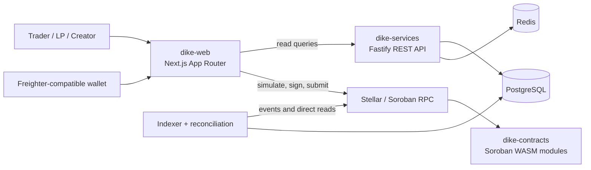

<div align="center">
  

  # Dike Protocol

  **Binary prediction markets on Stellar Soroban**

  [](https://www.rust-lang.org/)
  [](https://developers.stellar.org/docs/build/smart-contracts)
  [](https://nodejs.org/)
  [](https://nextjs.org/)
  [](https://stellar.org/)

  [Overview](#overview) · [Level 6 readiness](#level-6-readiness) · [Architecture](#architecture) · [Getting started](#getting-started) · [Testing](#testing) · [Deployment](#deployment)
</div>

Dike is a modular, collateral-backed prediction-market protocol. Users can create curated binary markets, trade YES/NO positions, provide liquidity, and resolve outcomes through optimistic proposals and Council of Dike dispute voting. The system uses Stellar Soroban smart contracts, a PostgreSQL-backed indexer/API, and a Next.js wallet application.

> [!IMPORTANT]
> This repository contains financial market infrastructure and deployed mainnet contracts. Start on local or testnet, verify every network/manifest/role configuration, and obtain an independent security review before putting real funds at risk.

## Overview

- **Collateral-backed markets** — USDC/SAC collateral backs complete YES/NO sets.
- **AMM trading** — traders buy and sell positions; liquidity providers receive pool shares.
- **Optimistic resolution** — anyone can request resolution, a proposer posts a bonded outcome, and undisputed cases finalize after a dispute window.
- **Council escalation** — disputed outcomes enter a whitelisted commit-reveal Council of Dike vote.
- **Indexed read model** — a replay-safe Soroban event indexer and reconciliation jobs expose query-ready state.
- **Wallet-native web app** — read paths use the backend API; write paths build, simulate, sign, submit, and poll Soroban transactions in the user's wallet.

## Level 6 readiness

This section maps the project to the Level 6 requirements and makes the remaining submission evidence explicit.

| Requirement | Evidence | Status |
| --- | --- | --- |
| Mainnet deployment | [Mainnet manifest](dike-contracts/deployments/mainnet.json), [address inventory](dike-contracts/deployments/mainnet-addresses.txt), and [production app](https://mainnet.dikeprotocol.xyz) | ✅ Deployed |
| Public production application | [mainnet.dikeprotocol.xyz](https://mainnet.dikeprotocol.xyz) | ✅ Live URL supplied |
| Real adoption | 20+ verified mainnet users with real on-chain transaction activity | ✅ Reported complete; link wallet/transaction evidence in the submission |
| Security | Mentor-led smart-contract audit/security review, alongside the documented tests and runbook | ✅ Completed; retain the mentor approval artifact |
| Product marketing | [Dike Protocol on X](https://x.com/DikeProtocol), [demo video](https://youtu.be/gr1-riQu5R8), and the public production app | ✅ Published |
| Ecosystem contribution | Technical/community contribution completed by the team | ✅ Completed; include the public artifact URL |
| Technical standards | Full setup docs plus preserved history from the original component repositories | ✅ Documentation and commit threshold met |

> [!WARNING]
> Keep the direct adoption, mentor-approval, marketing-post, and ecosystem-contribution URLs with the final submission. The README records the project status; the evaluator still needs the underlying evidence artifacts.

### Mainnet deployment evidence

The contracts below are deployed on the Stellar public mainnet. Each address links to Stellar Expert; the checked-in inventory and manifest are the canonical records.

| Module | Mainnet contract |
| --- | --- |
| `DikeTimelock` | [`CDVI736RDMJRREDKT5H5QPV4XSPDC73WDSTFTJKUYJSIENUDAMT47UUZ`](https://stellar.expert/explorer/public/contract/CDVI736RDMJRREDKT5H5QPV4XSPDC73WDSTFTJKUYJSIENUDAMT47UUZ) |
| `DikeGovernance` | [`CATDOYPGILMCIBVI6GRYVQ4KE6KSSAQPQN4OTFIAYKXBT2WFCGBASATJ`](https://stellar.expert/explorer/public/contract/CATDOYPGILMCIBVI6GRYVQ4KE6KSSAQPQN4OTFIAYKXBT2WFCGBASATJ) |
| `DikeMarketRegistry` | [`CDGQY6NVOCIG2VVNYGD4DIJA2KTATDKWK4D2VEAW77ZMOBPGLRWDZJ4O`](https://stellar.expert/explorer/public/contract/CDGQY6NVOCIG2VVNYGD4DIJA2KTATDKWK4D2VEAW77ZMOBPGLRWDZJ4O) |
| `DikeConditionalTokens` | [`CC5XBGMLJOJLIC6MXLWIJEPZPZYGCAJAGPQMGQJQO6NUC5BU3FYRQEPA`](https://stellar.expert/explorer/public/contract/CC5XBGMLJOJLIC6MXLWIJEPZPZYGCAJAGPQMGQJQO6NUC5BU3FYRQEPA) |
| `CollateralVault` | [`CBOJQMXGM3YEMYHVYYJCGTOICDYAHZPYMNRA5S22IUZ32DEHT4QPE6LO`](https://stellar.expert/explorer/public/contract/CBOJQMXGM3YEMYHVYYJCGTOICDYAHZPYMNRA5S22IUZ32DEHT4QPE6LO) |
| `DikeAMM` | [`CAHRXX47RAUPP6INARDFCVHQ26MLXS3AJPCXBYSKZANIYEDARG75MUBJ`](https://stellar.expert/explorer/public/contract/CAHRXX47RAUPP6INARDFCVHQ26MLXS3AJPCXBYSKZANIYEDARG75MUBJ) |
| `FeeManager` | [`CDSEJLVJTCDW4WTDHQZDLDFD6QY5B7HRVFGOKQHV3XVO7U6PK5L442OV`](https://stellar.expert/explorer/public/contract/CDSEJLVJTCDW4WTDHQZDLDFD6QY5B7HRVFGOKQHV3XVO7U6PK5L442OV) |
| `CODOracle` | [`CCDW3KT6AMFBLPTQWRK7QR6T6537JQKPRHBPKCHORQDJEHQQNWINWI5M`](https://stellar.expert/explorer/public/contract/CCDW3KT6AMFBLPTQWRK7QR6T6537JQKPRHBPKCHORQDJEHQQNWINWI5M) |
| `CouncilOfDike` | [`CBZJWMUZ26FSPVLA6MCFIPJU64LXONQGMRIMSGSBYGD7HFAPQX3EICM4`](https://stellar.expert/explorer/public/contract/CBZJWMUZ26FSPVLA6MCFIPJU64LXONQGMRIMSGSBYGD7HFAPQX3EICM4) |
| `DikeMarketFactory` | [`CDHHEZGWT7KAK6AIESV2VZVUB6ET7ZFKCTZ2442UTUML4GO6OJLG6ICC`](https://stellar.expert/explorer/public/contract/CDHHEZGWT7KAK6AIESV2VZVUB6ET7ZFKCTZ2442UTUML4GO6OJLG6ICC) |

Mainnet collateral is the Circle USDC Stellar Asset Contract [`CCW67TSZV3SSS2HXMBQ5JFGCKJNXKZM7UQUWUZPUTHXSTZLEO7SJMI75`](https://stellar.expert/explorer/public/contract/CCW67TSZV3SSS2HXMBQ5JFGCKJNXKZM7UQUWUZPUTHXSTZLEO7SJMI75), issued by [`GA5ZSEJYB37JRC5AVCIA5MOP4RHTM335X2KGX3IHOJAPP5RE34K4KZVN`](https://stellar.expert/explorer/public/account/GA5ZSEJYB37JRC5AVCIA5MOP4RHTM335X2KGX3IHOJAPP5RE34K4KZVN). The deployment authority, admin, and treasury address is [`GD3AXBA2SN4NY3534UY2V2B24L4NW6PFLJ6XGGLT24KEVV22TSFXMKZS`](https://stellar.expert/explorer/public/account/GD3AXBA2SN4NY3534UY2V2B24L4NW6PFLJ6XGGLT24KEVV22TSFXMKZS); protect this key accordingly.

### Evidence collection checklist

- **Adoption:** 20+ verified mainnet users and real transaction activity are complete; attach the wallet list and representative Stellar Expert transaction pages.
- **Security:** mentor-led audit/security review is complete; attach the written mentor/team approval artifact.
- **Marketing:** launch content is published on [Dike Protocol's X profile](https://x.com/DikeProtocol), with the [demo video](https://youtu.be/gr1-riQu5R8) available for showcase evidence.
- **Ecosystem contribution:** contribution is complete; attach the public technical/community artifact URL.

## Architecture



### Components

| Directory | Role | Primary stack |
| --- | --- | --- |
| [`dike-contracts`](dike-contracts/) | On-chain market, custody, AMM, oracle, council, fee, governance, and timelock modules | Rust, Soroban SDK 23 |
| [`dike-services`](dike-services/) | Event indexing, reconciliation, derived state, health/metrics, and REST queries | Node.js 20+, TypeScript, Fastify, PostgreSQL, Redis |
| [`dike-web`](dike-web/) | Market discovery, trading, liquidity, portfolio, resolution, council, and governance UI | Next.js 16, React 19, TypeScript, Stellar Wallets Kit |

The original component repositories contain 97 combined commits: [contracts (26)](https://github.com/Dike-Protocol/dike-contracts), [services (38)](https://github.com/Dike-Protocol/dike-services), and [web (33)](https://github.com/Dike-Protocol/dike-web). Their histories are preserved in this monorepo; the rebuilt tree contains 101 commits before this documentation tip.

### Contract graph

| Module | Responsibility |
| --- | --- |
| `DikeMarketFactory` | Curated market creation and initial AMM coordination |
| `DikeMarketRegistry` | Canonical metadata, market status, collateral support, and final outcomes |
| `DikeConditionalTokens` | YES/NO balances, complete-set minting, transfers, and redemption burns |
| `CollateralVault` | Collateral custody, accounting, redemptions, child-market credit, fees, and bonds |
| `DikeAMM` | Fixed-product pools, buys, sells, LP shares, and liquidity removal |
| `CODOracle` | Resolution requests, proposals, disputes, council escalation, and finalization |
| `CouncilOfDike` | Whitelisted commit-reveal voting for disputed markets |
| `FeeManager` | Fee, reward, and bond calculations |
| `DikeGovernance` / `DikeTimelock` | Governed configuration and delayed, cancellable critical actions |

## Repository layout

```text
.
├── dike-contracts/       # Soroban workspace, deployments, and operator scripts
├── dike-services/        # Indexer, reconciliation jobs, REST API, migrations
├── dike-web/             # Next.js frontend and wallet transaction flows
└── README.md             # This monorepo guide
```

Each component remains independently runnable and retains its own detailed README, environment template, CI configuration, plan, and license file.

## Getting started

### Prerequisites

- Git
- Rust stable with the `wasm32-unknown-unknown` target
- Stellar CLI with Soroban support
- Node.js 20 or newer and npm
- pnpm for `dike-web`
- Docker and Docker Compose for PostgreSQL and Redis
- A Freighter-compatible Stellar wallet for signed browser transactions

### Clone

```bash
git clone https://github.com/SachPlayZ/dike-monolith.git
cd dike-monolith
```

### 1. Verify and build contracts

```bash
cd dike-contracts
rustup target add wasm32-unknown-unknown
cargo test
cargo clippy --all-targets --all-features
cargo build --release --target wasm32-unknown-unknown
```

### 2. Run the backend and dependencies

In a second terminal:

```bash
cd dike-services
cp .env.example .env
docker compose up -d
npm install
npm run migrate
npm run dev
```

The API listens on `http://localhost:4000`. Before the first run against an empty database, set `INDEXER_START_LEDGER` to a retained ledger from the selected deployment; Soroban RPC cannot backfill event history from ledger 1. Keep `STELLAR_NETWORK`, the RPC/Horizon URLs, and `STELLAR_NETWORK_PASSPHRASE` aligned.

### 3. Run the web app

In a third terminal:

```bash
cd dike-web
cp .env.example .env
pnpm install
pnpm dev
```

Open [http://localhost:3000](http://localhost:3000). The frontend defaults to the backend at `http://localhost:4000`; it reads contract IDs from the selected `dike-web/lib/contracts/{testnet,mainnet}.json` manifest.

> [!TIP]
> For a first local pass, use the contract workspace's local flow and mock USDC only. Never use `mock_usdc` for testnet or mainnet collateral.

## Frontend routes

| Route | Purpose |
| --- | --- |
| `/dashboard` | Portfolio, LP shares, vault state, and redeemables |
| `/predictions` | Market list with status and category filters |
| `/markets/[marketId]` | Market detail, trading, liquidity, and resolution |
| `/review` | Reviewer path and deployed-contract links |
| `/create-predic` | Approved-creator market creation |
| `/resolve` | Propose, dispute, escalate, and finalize resolution |
| `/council` | Council commit-reveal voting and reward claims |
| `/admin` | Governance configuration and timelock actions |
| `/profile` | Connected wallet identity |

The browser validates the selected network, passphrase, manifest, and endpoint URL before enabling signing. Transaction errors are decoded against the contract error map, which must stay synchronized with `dike_types::DikeError`.

## Backend API

All monetary amounts are serialized as strings to preserve precision.

| Endpoint | Purpose |
| --- | --- |
| `GET /health` | Service, PostgreSQL, Redis, Soroban RPC, and indexer-lag health |
| `GET /metrics` | Processing failures, RPC errors, reconciliation mismatches, and lag counters |
| `GET /markets` | Cursor-paginated market summaries with filters and derived prices |
| `GET /markets/:id` | Market, pool, fee, vault, resolution, council, and trade detail |
| `GET /markets/:id/resolution` | Resolution state and derived next actions |
| `GET /users/:address/portfolio` | Positions, LP shares, vault state, and redeemables |
| `GET /council/cases` | Council cases and commit/reveal/finalize windows |
| `GET /admin/governance` | Governance, modules, collateral, creators, council, and fee configuration |
| `GET /admin/timelock` | Queued, executable, cancelled, and executed actions |

## Testing

Run checks from each component directory:

```bash
# dike-contracts
cargo test
cargo clippy --all-targets --all-features
cargo build --release --target wasm32-unknown-unknown

# dike-services
npm test
npm run lint
npm run build

# dike-web
pnpm test
pnpm lint
pnpm exec tsc --noEmit
pnpm build
```

Contract tests cover market creation, AMM behavior, vault accounting, oracle/council resolution, governance, timelock windows, and invariants. Service tests cover codecs, event routing, reducers, derived state, repository idempotency, and migrations. Web tests cover transaction encoding, ScVal conversion, portfolio normalization, and public-reference URL validation. Interactive wallet flows still require manual verification against the selected Stellar network.

## Deployment

### Contracts

Use the deployment scripts from `dike-contracts`:

```bash
cd dike-contracts

# Testnet with the default testnet USDC issuer
NETWORK=testnet SOURCE=alice ./scripts/deploy-testnet.sh

# Local/dev-only deployment with mock collateral
NETWORK=local ALLOW_MOCK_USDC=true ./scripts/deploy-testnet.sh
```

Deployment manifests are stored in [`dike-contracts/deployments/`](dike-contracts/deployments/). The full role-wiring, TTL, recovery, and safety runbook is in [`dike-contracts/docs/DEPLOYMENT.md`](dike-contracts/docs/DEPLOYMENT.md). Mainnet must use Circle's USDC Stellar Asset Contract or another explicitly verified collateral contract.

### Services

`dike-services` includes Docker packaging and GitHub Actions workflows for EC2 deployments. The workflow runs audit, lint, build, and tests, then deploys a revision-tagged candidate container, health-checks it, and retains the previous container for rollback. Keep production secrets in the server-side `.env`; do not commit them.

### Web

Deploy the Next.js app through the hosting platform's Git integration. Configure the `NEXT_PUBLIC_*` variables at build time and keep them aligned with the selected deployment manifest. Public variables are bundled into the browser; `DIKE_ADMIN_API_KEY` is server-only and must never use the `NEXT_PUBLIC_` prefix.

## Configuration reference

The checked-in templates are the canonical starting points:

- [`dike-services/.env.example`](dike-services/.env.example) — RPC/Horizon, manifest, database, Redis, indexer, and reconciliation settings.
- [`dike-web/.env.example`](dike-web/.env.example) — browser network, manifest, backend URL, and server-only admin key.
- [`dike-contracts/deployments/`](dike-contracts/deployments/) — contract IDs and network manifests consumed by the service and web app.

Network, passphrase, manifest, and endpoint mismatches are intentionally treated as configuration errors. Fix those values before troubleshooting application behavior.

## Safety notes

- Verify the collateral contract and network before enabling a market.
- Keep v1 market creation, supported collateral, module wiring, fees, and council membership curated.
- Simulate Soroban transactions and review the declared maximum XLM fee before signing.
- Use timelock-controlled governance for critical module, fee, treasury, collateral, council, and upgrade changes.
- Protect deployment/admin keys with hardware-backed or equivalent custody.
- Review the vault's custody, redemption, child-credit, fee, and bond logic especially closely.
- Run the full test suites and an independent security review before production liquidity.

## Further reading

- [Smart contract details](dike-contracts/README.md)
- [Deployment runbook](dike-contracts/docs/DEPLOYMENT.md)
- [Backend/indexer details](dike-services/README.md)
- [Frontend and wallet details](dike-web/README.md)
- [Protocol design plan](dike-contracts/PLAN.md)
- [Product demo video](https://youtu.be/gr1-riQu5R8)
