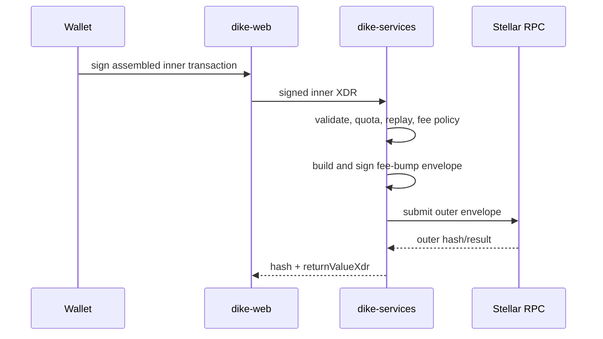

# Fee sponsorship

Dike fee sponsorship uses Stellar's native fee-bump envelope. The connected
wallet remains the source of the inner Soroban transaction and signs the user
operation. `dike-services` validates that signed inner envelope, wraps it in a
fee-bump transaction, signs the outer envelope with the sponsor account, and
submits it through Stellar RPC.

The fee-bump fee is the sponsor's declared inclusion bid multiplied by the
number of inner operations plus one outer operation, plus the Soroban resource
fee. The user account still needs normal account reserves and any assets used
by the contract; sponsorship covers the network fee only.

## Trust boundaries

- Browser code may submit arbitrary input and is never trusted for policy.
- The service accepts only signed, one-operation Soroban transactions whose
  source signature and network passphrase validate locally.
- Contract IDs come from the loaded deployment manifest. Method names come
  from the checked-in app allowlist.
- The sponsor seed is server-only runtime configuration. It is never returned
  to the browser, logged, or included in error text.
- Redis provides atomic quotas, daily declared-fee reservations, and replay
  locks. RPC remains the source of truth for transaction state.

## Rollout and rollback

Sponsorship is disabled by default. Enable it on testnet first, fund only the
sponsor account, and watch rejected requests, declared-fee budget, and outer
transaction confirmation latency. Disable the flag to return to the existing
direct-submit path. Disabling sponsorship does not cancel already submitted
fee-bump transactions.

The v1 verifier accepts a standard G-account source with its source signature.
Multisig and custom signer policies require a separate verifier design.
